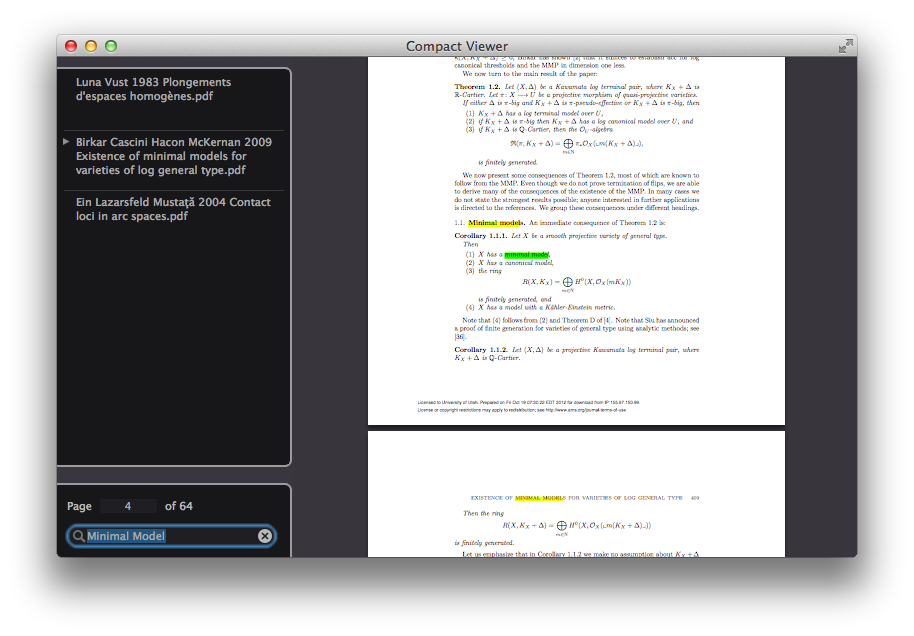

Compact Viewer
==============

A simple PDF viewer for Mac. One window, lots of files.

Download: [version 1.0][1]

[1]: https://github.com/roidocampo/Compact-Viewer/releases/download/v1.0/Compact.Viewer.dmg

Why?
----

When reading PDF files in my computer, I prefer a single-window interface
with an easy way of switching between the opened files. I used
[Clearview][] for a while, which has a tabbed interface, but was never
quite happy with it. So I decided to create a new viewer. It was also a
excuse to learn how to program for the Mac platform.

[Clearview]: http://www.canoejoy.com/

Screenshot
----------

Disclaimer
----------

This is my first Mac application ever. Expect rough edges.

<!-- 
vi: spell
-->
